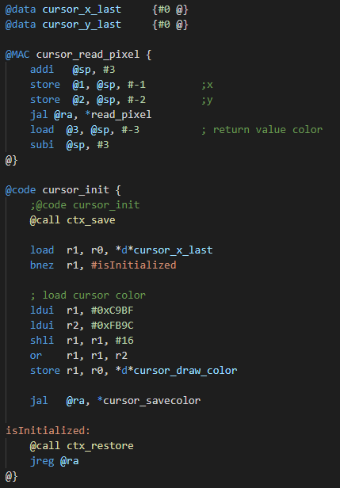

# HaDes Assembler

Syntax highlighting for the HaDes assembler makes it much easier to code your own small assembler program.

## Features

* Basic syntax highlight for everything
* Brace matching
* Some code snippets

## License
This extension is licensed under the MIT License. Please see the third-party notices file for details on the third-party binaries that we include with releases of this project.
